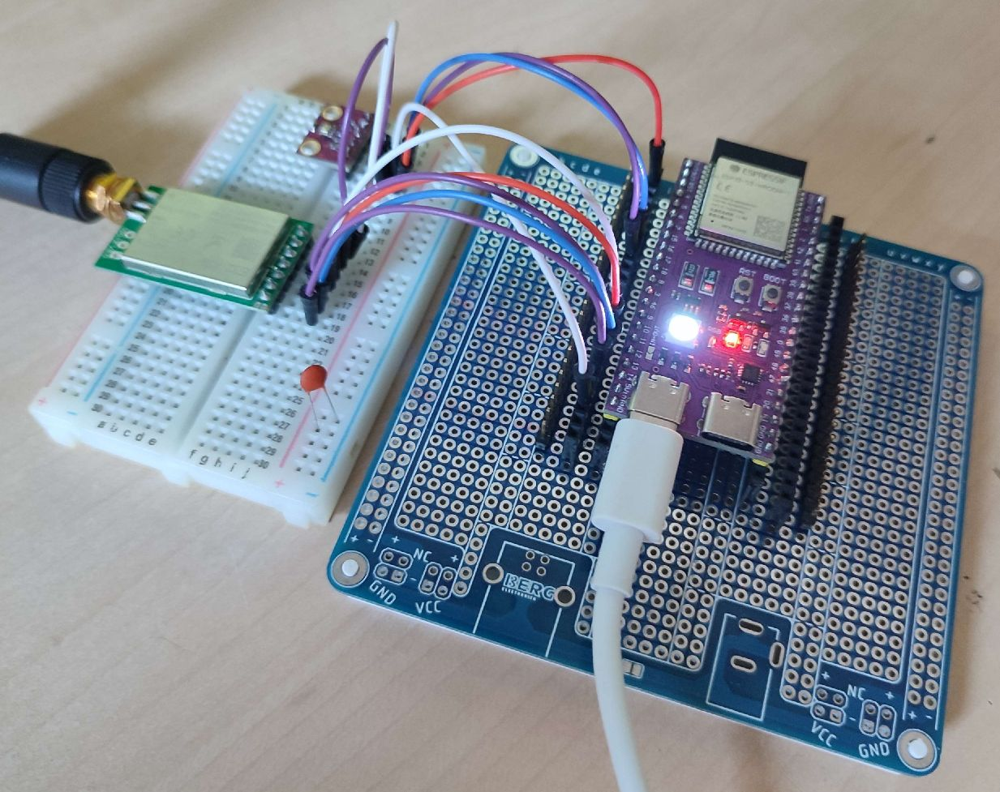
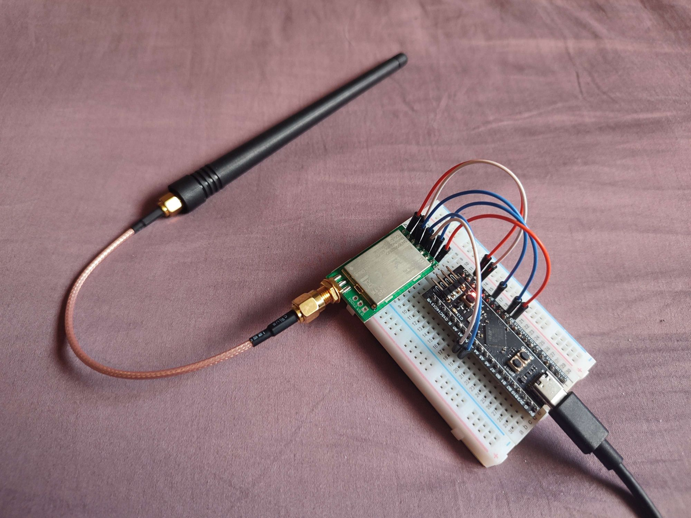

.. role:: raw-html(raw)
    :format: html

Wiring
------
The pictures in this section will be changed to better ones soon.

ESP32-S3
^^^^^^^^
TODO

:raw-html:`[Insert caption here...]`

STM32 Black Pill
^^^^^^^^^^^^^^^^
In this example, E32 module is connected to a STM32F411CE Black Pill.

This MCU requires the some specific pins to be used for the UART bus.
:raw-html:` `
The MCU's `USART1` pins are both used out-of-the-box, so we'll need to use the `USART2` pins.

+---------+--------------+-----------+---------------+------------------+
| E32 Pin | Pin constant | STM32 Pin | Pin function  | Alternatives     |
+=========+==============+===========+===============+==================+
| **M0**  | ``board.B3`` | ``PB3``   | Generic I/O   | Any output pin   |
+---------+--------------+-----------+---------------+------------------+
| **M1**  | ``board.B4`` | ``PB4``   | Generic I/O   | Any output pin   |
+---------+--------------+-----------+---------------+------------------+
| **RXD** | ``board.A2`` | ``PA2``   | ``USART2_TX`` | **None**         |
+---------+--------------+-----------+---------------+------------------+
| **TXD** | ``board.A3`` | ``PA3``   | ``USART2_RX`` | **None**         |
+---------+--------------+-----------+---------------+------------------+
| **AUX** | ``board.B7`` | ``PB7``   | Generic I/O   | Any input pin    |
+---------+--------------+-----------+---------------+------------------+

:raw-html:`[Insert caption here...]`

Other boards
^^^^^^^^^^^^
Other boards should work similarly to the `ESP32-S3` unless they have specific limitations.

If you have any other that have some special requirements or you think are worth mentioning, don't hesitate to create
an issue on the repo with a picture of your wiring.

We'd be glad to include it on this page.
