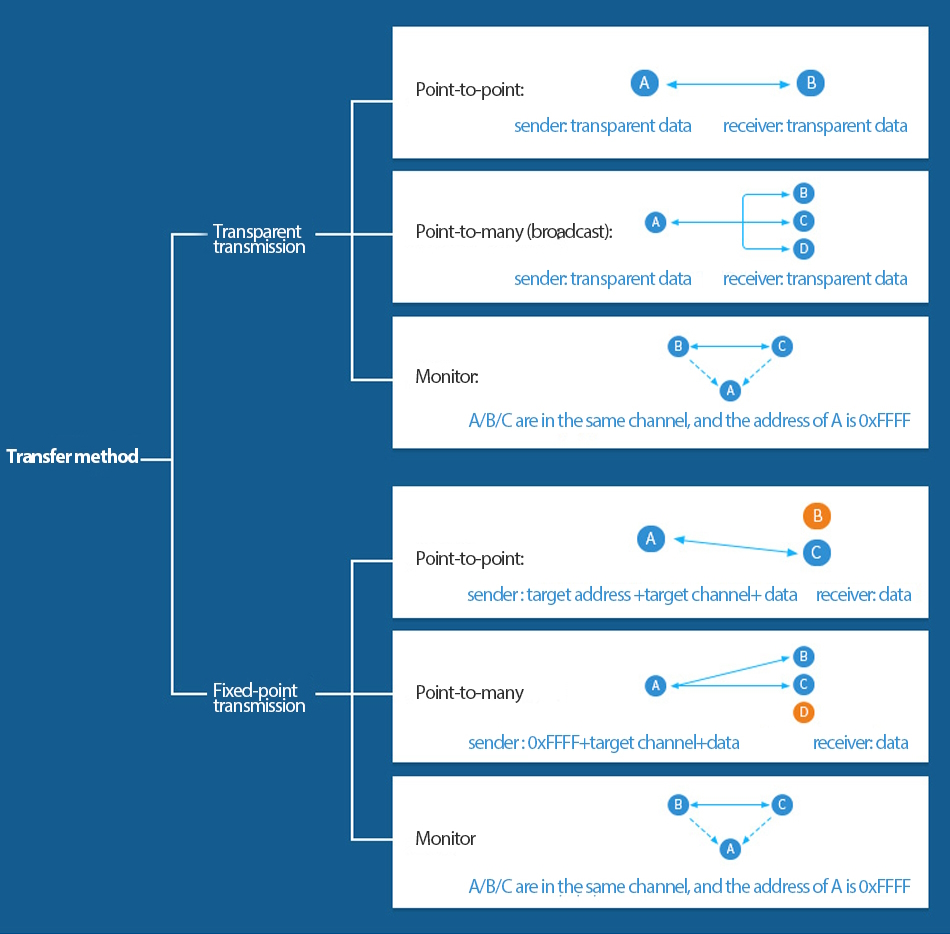

.. role:: raw-html(raw)
    :format: html

E32 Modules
-----------

Wiring
^^^^^^
+------------+---------------------------------+
| E32 Module | MCU                             |
+============+=================================+
| `M0`       | Any digital output pin          |
+------------+---------------------------------+
| `M1`       | Any digital output pin          |
+------------+---------------------------------+
| `RXD`      | Any UART **TX** capable pin*    |
+------------+---------------------------------+
| `TXD`      | Any UART **RX** capable pin*    |
+------------+---------------------------------+
| `AUX`      | Any digital input pin**         |
+------------+---------------------------------+
| `VCC`      | Power supply                    |
+------------+---------------------------------+

\*: Some devices may require you to use very specific pins for the UART bus.
:raw-html:` `
\*\*: This pin can be left floating, but the module's AUX response times will be estimated and inaccurate.
:raw-html:` `
\*\*\*: Should be between 3.3V and 5.0V **for less than 5W**, more than 5.2V can cause damage, and some modules support 2.3V !

Model Number Structure
^^^^^^^^^^^^^^^^^^^^^^
The E32 modules all have a unique name that gives you some information about its abilities, form factor and more.

Here is the standard format:
:raw-html:` `
``E32-{Frequency}{Interface}{TX Power Max dBm}{Form Factor}{Optional Variant}``

Frequency
"""""""""
``170`` ➜ 160-173.5 MHz
:raw-html:` `
``400`` ➜ 410-525 MHz
:raw-html:` `
``433`` ➜ 410-441 MHz
:raw-html:` `
``868`` ➜ 862-893 MHz
:raw-html:` `
``900`` ➜ 862-931 MHz
:raw-html:` `
``915`` ➜ 900-931 MHz

Interface
"""""""""
``T`` ➜ UART
:raw-html:` `
``M`` ➜ SPI

Max Power
"""""""""
``20`` ➜ 20dBm / 100mW
:raw-html:` `
``30`` ➜ 30dBm / 1W
:raw-html:` `
``33`` ➜ 33dBm / 2W
:raw-html:` `
``37`` ➜ 37dBm / 5W  `(Special PSU requirements)`

Form Factor
"""""""""""
``D`` ➜ DIP `(Dual In-line Package)`
:raw-html:` `
``S`` ➜ SMD `(Surface Mount Device)`

Optional Variant
""""""""""""""""
The optional variant can be a number that may have a letter after it, or just a letter:
:raw-html:` `
``1``, ``2``, ``2T``, ``3``, ``C``, ``T``

I don't know what the letter mean for sure,
it could be related to the minimum voltage input since it seems to be different on those.

Supported Modules
^^^^^^^^^^^^^^^^^
+-------------------+-----------------+----------------------+---------+
| Model             | Max TX Power    | Frequencies          | Chipset |
+===================+=================+======================+=========+
| ``E32-170T30D``   | 30 dBm / 1 W    | *160-173.5 MHz*      | SX1278  |
+-------------------+-----------------+----------------------+         |
| ``E32-400T20S``   | 20 dBm / 100 mW | *410-525 MHz*        |         |
|                   |                 |                      |         |
| ``E32-400T20S3``  |                 | EU443                |         |
|                   |                 |                      |         |
|                   |                 | CN470-510            |         |
+-------------------+-----------------+----------------------+         |
| ``E32-443T20DC``  | 20 dBm / 100 mW | *410-441 MHz*        |         |
|                   |                 |                      |         |
| ``E32-443T20DT``  |                 | EU433                |         |
|                   |                 |                      |         |
| ``E32-443T20S``   |                 |                      |         |
|                   |                 |                      |         |
| ``E32-433T20S1``  |                 |                      |         |
|                   |                 |                      |         |
| ``E32-443T20S2T`` |                 |                      |         |
|                   |                 |                      |         |
| ``E32-443T20S3``  |                 |                      |         |
+-------------------+-----------------+                      |         |
| ``E32-443T30D``   | 30 dBm / 1 W    |                      |         |
|                   |                 |                      |         |
| ``E32-443T30S``   |                 |                      |         |
+-------------------+-----------------+                      |         |
| ``E32-443T33S``   | 33 dBm / 2W     |                      |         |
+-------------------+-----------------+                      |         |
| ``E32-443T37S``   | 37 dBm / 5W     |                      |         |
+-------------------+-----------------+----------------------+---------+
| ``E32-868T20D``   | 20 dBm / 100 mW | *862-893 MHz*        | SX1276  |
|                   |                 |                      |         |
| ``E32-868T20S``   |                 | EU863-870            |         |
+-------------------+-----------------+                      |         |
| ``E32-868T30D``   | 30 dBm / 1 W    | IN865-867            |         |
|                   |                 |                      |         |
| ``E32-868T30S``   |                 |                      |         |
+-------------------+-----------------+----------------------+         |
| ``E32-900T20D``   | 20 dBm / 100 mW | *862-931 MHz*        |         |
|                   |                 |                      |         |
| ``E32-900T30S``   |                 | EU863-870            |         |
+-------------------+-----------------+                      |         |
| ``E32-900T30D``   | 30 dBm / 1 W    | IN865-867            |         |
|                   |                 |                      |         |
| ``E32-900T30S``   |                 | AS920-923 ("AS1")    |         |
|                   |                 |                      |         |
|                   |                 | AS923-925 ("AS2")    |         |
|                   |                 |                      |         |
|                   |                 | AU915-928            |         |
|                   |                 |                      |         |
|                   |                 | KR920-923            |         |
|                   |                 |                      |         |
|                   |                 | US902-928            |         |
+-------------------+-----------------+----------------------+         |
| ``E32-915T20D``   | 20 dBm / 100 mW | *900-931 MHz*        |         |
|                   |                 |                      |         |
| ``E32-915T20S``   |                 | AS920-923            |         |
+-------------------+-----------------+                      |         |
| ``E32-915T30D``   | 30 dBm / 1 W    | AU915-928 ("AS1")    |         |
|                   |                 |                      |         |
| ``E32-915T30S``   |                 | AS923-925 ("AS2")    |         |
|                   |                 |                      |         |
|                   |                 | KR920-923            |         |
|                   |                 |                      |         |
|                   |                 | US902-928            |         |
+-------------------+-----------------+----------------------+---------+

All frequencies with a `{Region}xxx-yyy` code used for LoRaWAN depending on your location.

The ``E32-400`` and ``E32-900`` variants support more channels per modules.

Unsupported Modules
^^^^^^^^^^^^^^^^^^^
+-------------------+-----------------+-------------+---------+
| Model             | Max TX Power    | Frequencies | Chipset |
+===================+=================+=============+=========+
| ``E32-400M20S``   | 20 dBm / 100 mW | 433/470MHz  | SX1278  |
+-------------------+-----------------+             |         |
| ``E32-400M20S``   | 30 dBm / 1 W    |             |         |
+-------------------+-----------------+-------------+---------+
| ``E32-443T27D``   | ???             | ???         | ???     |
+-------------------+-----------------+-------------+---------+
| ``E32-900M20S``   | 20 dBm / 100 mW | 868/915MHz  | SX1276  |
+-------------------+-----------------+             |         |
| ``E32-900M30S``   | 30 dBm / 1 W    |             |         |
+-------------------+-----------------+-------------+---------+

The ``E32-***M**S`` variants has very basic datasheets, no concrete frequencies could be found.

The ``E32-433T27D`` variant is mentioned in the `E32 V1.30 User Manual
<https://www.ebyte.com/en/pdf-down.aspx?id=775>`_,
and on its `product page <https://www.ebyte.com/en/product-view-news.html?id=141>`_
but no proper datasheet could be found for it.

Transmission Modes
^^^^^^^^^^^^^^^^^^
The E32 modules support 2 modes of communication named `"Transparent"` and `"Fixed"`.

The main characteristic of `"Fixed"` mode is that it requires you to prepend you message with a target
address and channel.

And for `"Transparent"` mode, you can broadcast as well as monitor.

Please note that Ebyte's infographic shown below doesn't state that modules in `"Transparent"` modes needs
to be set on the same channel and address, but you absolutely need to.

:raw-html:`E32 Transmission modes.  Credit: Ebyte's official store on aliexpress.com`

Datasheets
^^^^^^^^^^
All datasheets are hosted by Ebyte on *ebyte.com* and *cdebyte.com* unless specified otherwise.

* `E32-170T30D <https://www.cdebyte.com/pdf-down.aspx?id=896>`_

* `E32-400M20S <https://www.cdebyte.com/pdf-down.aspx?id=1794>`_
* `E32-400M30S <https://www.ebyte.com/en/downpdf.aspx?id=1624>`_
* `E32-400T20S <https://www.cdebyte.com/pdf-down.aspx?id=895>`_

* `E32-443T20DC <https://www.ebyte.com/en/downpdf.aspx?id=130>`_
* `E32-443T20DT <https://www.cdebyte.com/pdf-down.aspx?id=858>`_
* `E32-443T20S <https://www.cdebyte.com/pdf-down.aspx?id=1957>`_
* `E32-433T20S1 <https://www.ebyte.com/en/downpdf.aspx?id=229>`_
* `E32-443T20S2T <https://www.ebyte.com/en/downpdf.aspx?id=227>`_
* `E32-443T30D <https://www.ebyte.com/en/downpdf.aspx?id=108>`_
* `E32-443T30S <https://www.cdebyte.com/pdf-down.aspx?id=2347>`_
* `E32-433T33S <https://www.manualslib.com/manual/2938896/Ebyte-E32-433t33s.html>`_ (manualslib.com)
* `E32-443T37S <https://www.cdebyte.com/pdf-down.aspx?id=2215>`_

* `E32-868T20D <https://www.ebyte.com/en/downpdf.aspx?id=132>`_
* `E32-868T20S <https://www.ebyte.com/en/downpdf.aspx?id=551>`_
* `E32-868T30D <https://www.ebyte.com/en/downpdf.aspx?id=189>`_
* `E32-868T30S <https://www.ebyte.com/en/downpdf.aspx?id=318>`_

* `E32-900T20D <https://www.cdebyte.com/pdf-down.aspx?id=2322>`_
* `E32-900T20S <https://www.cdebyte.com/pdf-down.aspx?id=2323>`_
* `E32-900M20S <https://www.cdebyte.com/pdf-down.aspx?id=1875>`_
* `E32-900M30S <https://www.cdebyte.com/pdf-down.aspx?id=1415>`_
* `E32-900T30S <https://www.cdebyte.com/pdf-down.aspx?id=2348>`_
* `E32-900T30D <https://www.ebyte.com/en/downpdf.aspx?id=1525>`_

* `E32-915T20D <https://www.ebyte.com/en/downpdf.aspx?id=131>`_
* `E32-915T20S <https://www.ebyte.com/en/downpdf.aspx?id=552>`_
* `E32-915T30D <https://www.ebyte.com/en/downpdf.aspx?id=174>`_
* `E32-915T30S <https://www.ebyte.com/en/downpdf.aspx?id=319>`_

If any datasheet becomes unavailable, please open an issue.
:raw-html:` `
We also keep copies of them over at `files.nibblepoker.lu <https://files.nibblepoker.lu/datasheets/ebyte/e32/>`_
just in case.

Alternatively, `manualslib.com <https://www.manualslib.com/products/Ebyte-E32-Series-10450561.html>`_ has a pretty good
collection of the most common ones.
