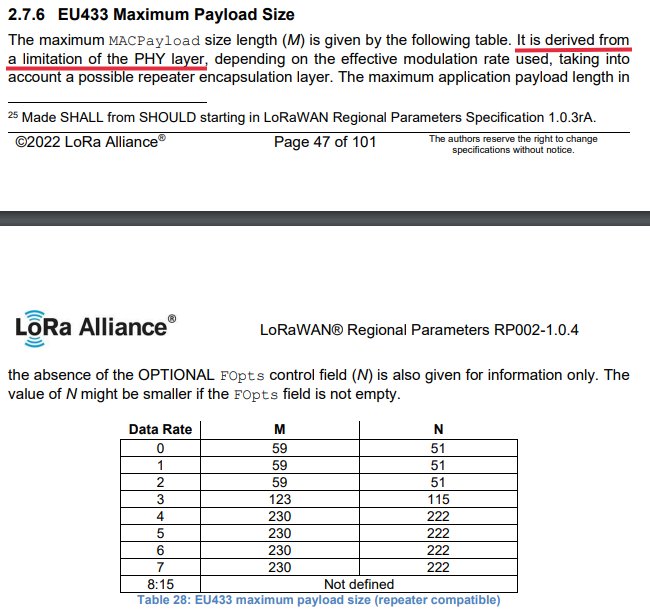

.. role:: raw-html(raw)
    :format: html

LoRa
----
Also referred to as `LoRa PHY`.

TODO: Add more.

Max Message Length
^^^^^^^^^^^^^^^^^^
⚠️ **Do not confuse with LoRaWAN limits** ⚠️

This limit can be **somewhat** ignored when using transparent communications since the message doesn't
contain the target address and channel.

Official limits
"""""""""""""""
I couldn't find any concrete limits for packet size on LoRa PHY.

All I know is that is depends on a maximum air-time limit enforced by local RF laws which is defined by the
air data rate and some other parameters.

Here is an excerpt from the `"LoraWAN Regional Parameters RP002-1.0.4"` document:

:raw-html:`Mention of PHY restrictions finfluencing LoRaWAN max packet size.`

Observed limits
"""""""""""""""
TODO: Check if it depends on that `"mystical"` spread factor or just parameters and region.

If you can, please contribute to these tables by raising an issue.

Documentation
"""""""""""""

* `LoRaWAN Packet Size Considerations (By The Things Network) <https://lora-developers.semtech.com/documentation/tech-papers-and-guides/the-book/packet-size-considerations>`_

Spreading Factor (SF)
^^^^^^^^^^^^^^^^^^^^^
The spreading factor is a mechanism that influence the air data rate, time-on-air and the receiver's sensitivity.
:raw-html:` `
It can be one of 6 values between ``SF7`` and ``SF12``.

I can't for the life of me give you a clear and concise explanation or table of these values and their effect
as well as the operating parameters that would be appropriate for them.
:raw-html:` `
**Absolutely nobody who should be able to** can make a document that is concise, complete and
doesn't expect the reader to glue bits and pieces from 20+ different documents to get a complete view that
doesn't only cover part of these SF values because of some arcane reasons.

Here are some links to documentation I'd recommend on the subject:

* `Spreading Factors (By The Things Network) <https://www.thethingsnetwork.org/docs/lorawan/spreading-factors/>`_

* `Spreading Factor (By iotjourney.orange.com) <https://iotjourney.orange.com/en/support/faq/spreading-factor-(sf)>`_

* `LoRa SF explained (By blog.ttulka.com) <https://blog.ttulka.com/lora-spreading-factor-explained/>`_

Good luck.
